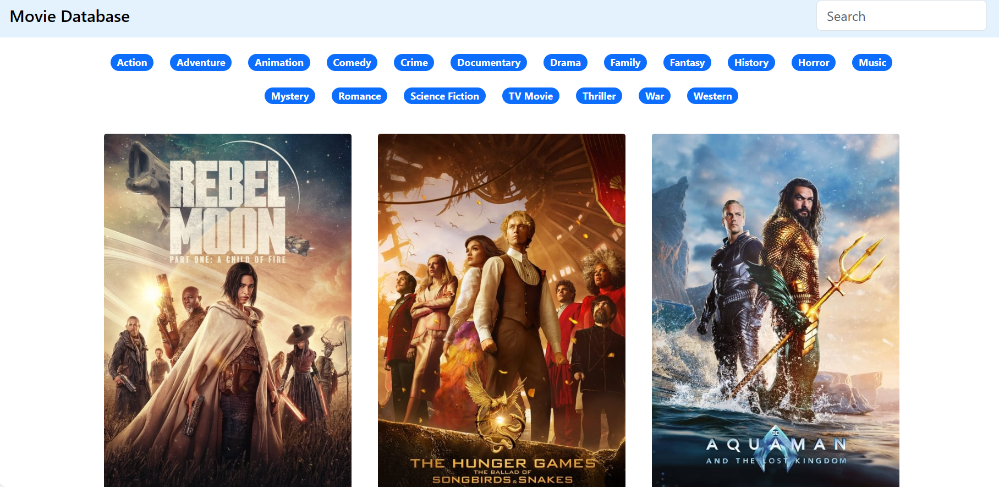

# Movie Mania

## Description

Movie Mania is a web application that provides comprehensive information about movies. Leveraging TMDB movie APIs, the app allows users to explore details about movies, search for movies based on genres, and access a vast database of cinematic information.

## Features

- **Movie Information:** Displays detailed information about movies, including cast, crew, release date, and user ratings.
- **Genre-based Search:** Enables users to search for movies based on genres, providing a customized movie browsing experience.
- **TMDB API Integration:** Consumes TMDB movie APIs for up-to-date and accurate movie data.

## Technology Stack

- **Frontend:** JavaScript, Bootstrap, HTML, CSS
- **Movie Information API:** TMDB movie APIs

## Project Responsibilities

- **API Integration:** Successfully integrated TMDB movie APIs to fetch and display movie information.
- **Frontend Development:** Implemented the user interface using JavaScript, Bootstrap, HTML, and CSS.
- **Genre-based Search Feature:** Developed functionality for users to search movies based on genres.

## Outcome

Movie Mania has emerged as a go-to platform for movie enthusiasts, providing a user-friendly interface to explore and discover information about their favorite films. The integration with TMDB APIs ensures access to a rich database of movie details, enhancing the overall user experience.

